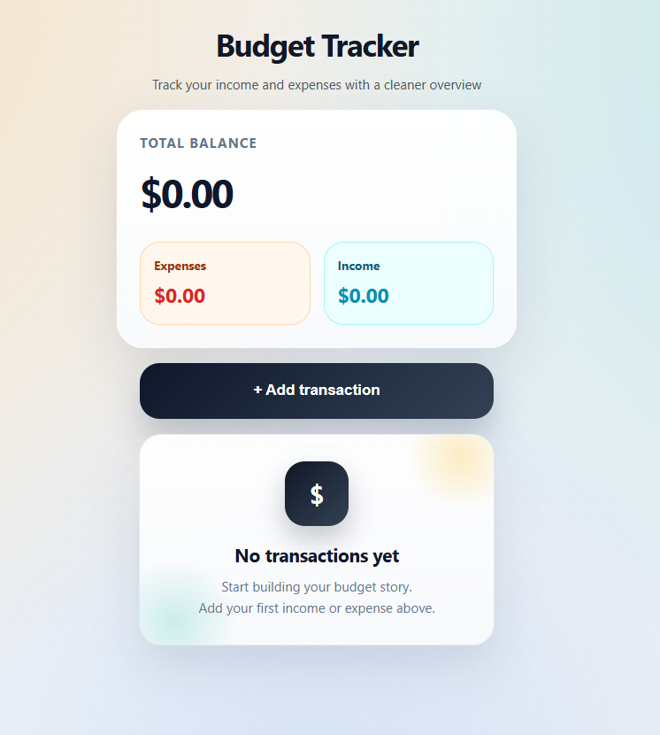

# 💰 Budget Tracker

A simple and clean React + TypeScript app for tracking personal income and expenses.

## 🚀 Live Demo

https://majkan1.github.io/Mini-Budget-Tracker/

## 📸 Preview



---

## 🛠️ Tech Stack

- **React 18** — UI
- **TypeScript** — type safety
- **CSS-in-JS** — all styles written inline

---

## 📁 Project Structure

```
src/
├── App.tsx        # All components and logic
└── main.tsx       # Entry point
```

---

## ⚙️ Features

- Add **income** and **expense** transactions
- Real-time **total balance**, income and expense summary
- Each transaction includes:
  - Title
  - Amount
  - Date
  - Type (income / expense)
  - Category
- Transaction **history list** with color-coded entries
- Empty state screen when no transactions exist

---

## 📦 Installation

```bash
# Clone the repository
git clone https://github.com/your-username/your-repo-name.git

# Navigate to the project folder
cd your-repo-name

# Install dependencies
npm install

# Start the development server
npm run dev
```

App will be available at `http://localhost:5173`

---

## 📋 Data Model

```ts
type Transaction = {
  id: number
  title: string
  amount: number
  date: string
  type: 'income' | 'expense'
  category: string
}
```

---

## 🗂️ Categories

- Food and Dining
- Transport
- Entertainment
- Shopping
- Bills & Utilities
- Health
- Other

---

## 📄 License

MIT
